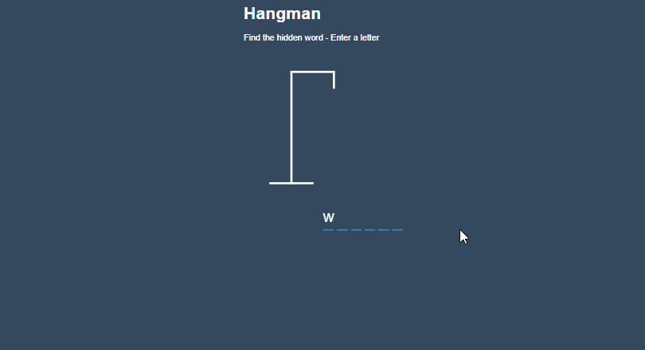

# 🚀 React Hangman

> This is a simple hangman game built with React.js.

[](LICENSE)
[]()

---

## 📸 Demo / Screenshots

<p align="center">
  
</p>

---

## 📜 About

One of my first React.js projects. Based off a tutotrial. The Guess words are stored in a array and gets picked randomly. It is a very basic hangman app, but was fun to build

---

## ✨ Features

- ✅ randomized words
- ✅ keyboard events
- ✅ user gets muiltiple chances to guess the letter

---

## 🛠 Tech Stack

**Frontend:** React.js, HTML, CSS  
**Backend:** None
**Database:** None

---

## ⚙️ Installation

```bash
# Clone the repo
git clone https://github.com/Daneelv/hangman-react.git

# Install dependencies
npm install

# Run locally
npm run start
```
